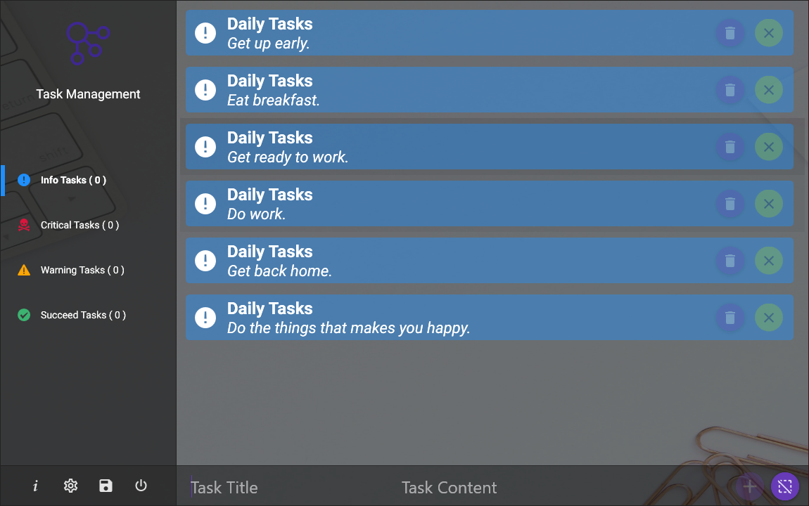
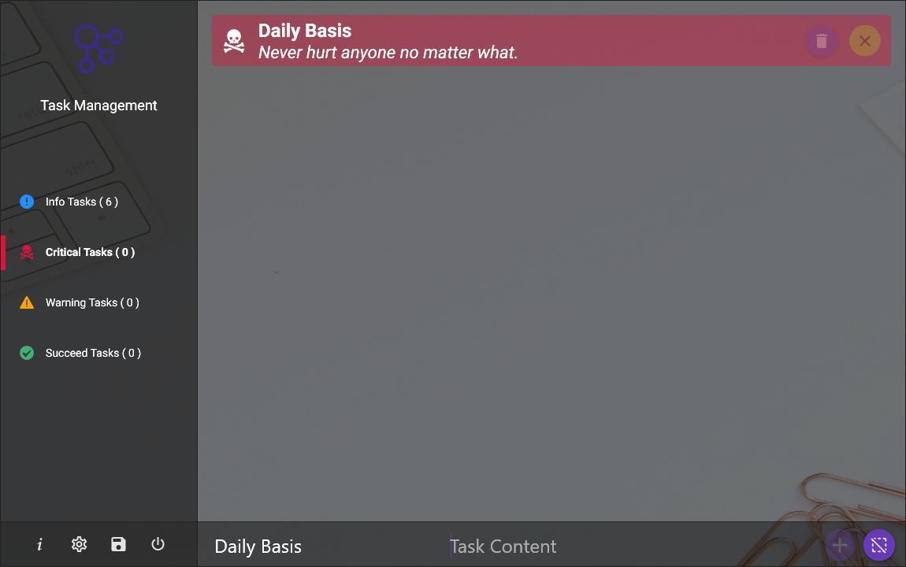
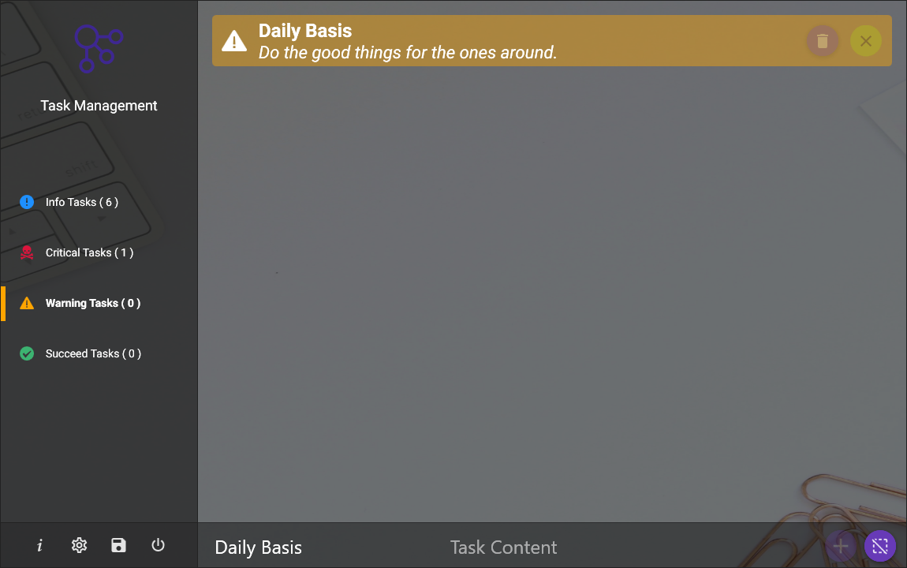
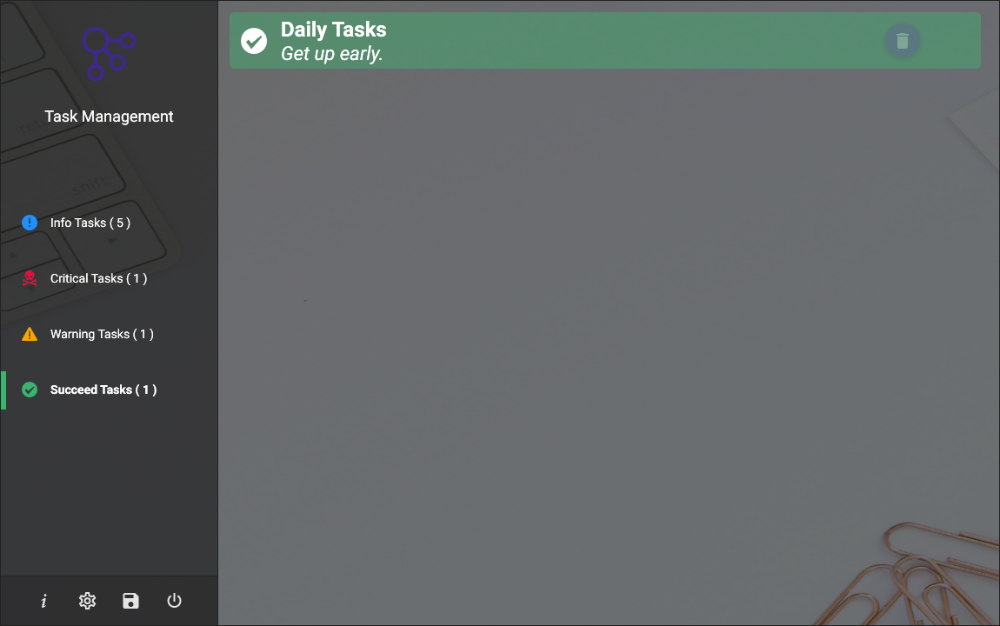
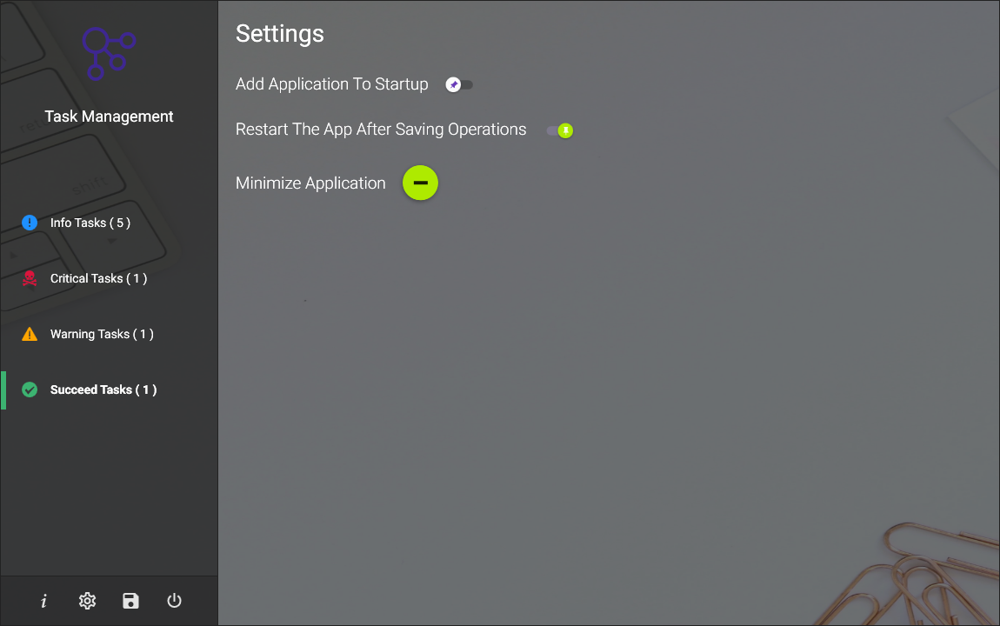
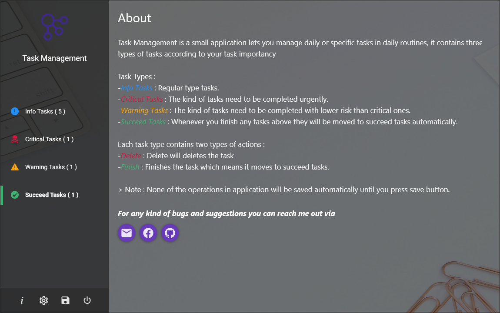

# TaskList Management
An Application to enable users to manage their daily basis tasks easily.

## UI

### Clean UI (Semi-Transparent).

___

## Features

### Info Tasks
- Ability to apply CRUD operations.
- Ability to finishing the tasks.

### Critical Tasks
- Ability to apply CRUD operations.
- Ability to finishing the tasks.

### Warning Tasks
- Ability to apply CRUD operations.
- Ability to finishing the tasks.

### Info Tasks
- Delete the tasks.

## Screenshots

                          

                          

                           

                           

   

 

## License

> [MIT LICENSE](./LICENSE).